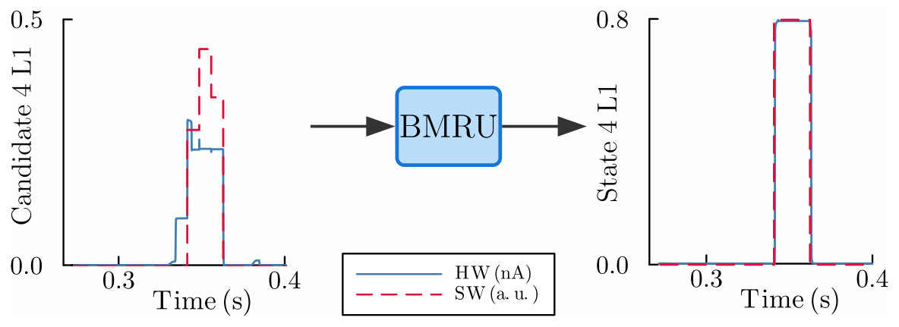

Our preprint **"Hardware-Software Co-Design of Scalable, Energy-Efficient Analog Recurrent Computations"**, is on [arXiv](https://arxiv.org/abs/2605.15216). It is the extended version of the work I wrote about when it was [accepted at ICNCE 2026](https://julienbrandoit.github.io/posts/icnce2026/).

## The idea

Bistable Memory Recurrent Units (BMRUs) update in discrete steps and hold their state, which happens to be what a current-mode analog memory cell does naturally below threshold. That match is what makes the co-design work: the network is not forced onto the hardware, the two are designed against each other from the start.

The discrete state also does something useful for reliability. Because each cell output is quantised, noise does not accumulate through the temporal feedback loop, and we measure at least a 20-fold reduction in noise propagation.

***Figure 13: 20× error suppression at BMRU cell boundaries.** Candidate signals at the BMRU input (left) show clear discrepancies between the software prediction and the circuit simulation. After the BMRU, the resulting states (right) agree closely.*

The part I find most useful is the scaling analysis. Working at transistor level, we show that **the power cost of the recurrent components grows linearly with size, while the feedforward layers grow quadratically**. On keyword spotting we reach sub-microwatt inference at the RNN core.

## Resources

📄 **Preprint**: [arXiv:2605.15216](https://arxiv.org/abs/2605.15216)

**Authors**: Arthur Fyon, Julien Brandoit, Loris Mendolia, Damien Ernst, Jean-Michel Redouté, Guillaume Drion

**Contact:** For questions or collaborations, please reach out to me at [jbrandoit@uliege.be](mailto:jbrandoit@uliege.be).

*Arthur Fyon's webpage*: [Arthur Fyon](https://arthur-fyon.github.io/)

*Loris Mendolia's webpage*: [Loris Mendolia](https://lorismendolia.github.io/)

*Damien Ernst's webpage*: [Damien Ernst](https://damien-ernst.be/)

*Jean-Michel Redouté's webpage*: [Jean-Michel Redouté](https://people.montefiore.uliege.be/jmredoute/)

*Guillaume Drion's webpage*: [Guillaume Drion](https://scholar.google.com/citations?user=LchHbKkAAAAJ&hl=en)

## Acknowledgments

This work has been the subject of patent applications under numbers EP26175243.0 and EP26175248.9.
