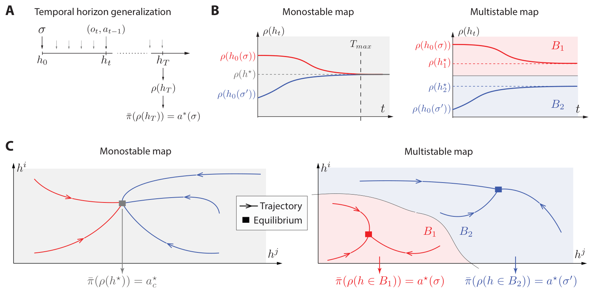

A preprint I contributed to, led by Asad Bakija and Florent De Geeter, is available on [arXiv](https://arxiv.org/abs/2605.12206): **"On the Importance of Multistability for Horizon Generalization in Reinforcement Learning"**.

## The question

An agent is trained on episodes of a given duration. What happens when you ask it to keep behaving correctly on longer ones? Under partial observability this turns out to be a real failure mode, and it is not obvious which property of the architecture is responsible for it.

## The result

We show that **multistability is a necessary condition for horizon generalization**. If a network cannot hold several stable internal states, it cannot keep track of what it needs to across a horizon longer than the one it was trained on. We also show that multistability is complementary to transient dynamics rather than a replacement for it: the two mechanisms do different jobs, and a model needs both.

***Figure 1: Temporal horizon generalization.** **A.** Schematic definition. **B.** Time evolutions for a monostable map (left) and a multistable map (right). **C.** The same contrast in the phase plane. The red and blue colors show the basins of attraction of each fixed point in the multistable case.*

This has a direct consequence for the architectures people actually use. State space models and gated linear RNNs are attractive because they parallelize over time, but they are not multistable, and they underperform as soon as the task requires generalizing to longer horizons.

## Resources

📄 **Preprint**: [arXiv:2605.12206](https://arxiv.org/abs/2605.12206)

**Authors**: Asad Bakija, Florent De Geeter, Julien Brandoit, Pierre Sacré, Guillaume Drion

**Contact:** For questions or collaborations, please reach out to me at [jbrandoit@uliege.be](mailto:jbrandoit@uliege.be).

*Pierre Sacré's webpage*: [Pierre Sacré](https://sites.google.com/view/psacre/)

*Guillaume Drion's webpage*: [Guillaume Drion](https://scholar.google.com/citations?user=LchHbKkAAAAJ&hl=en)
